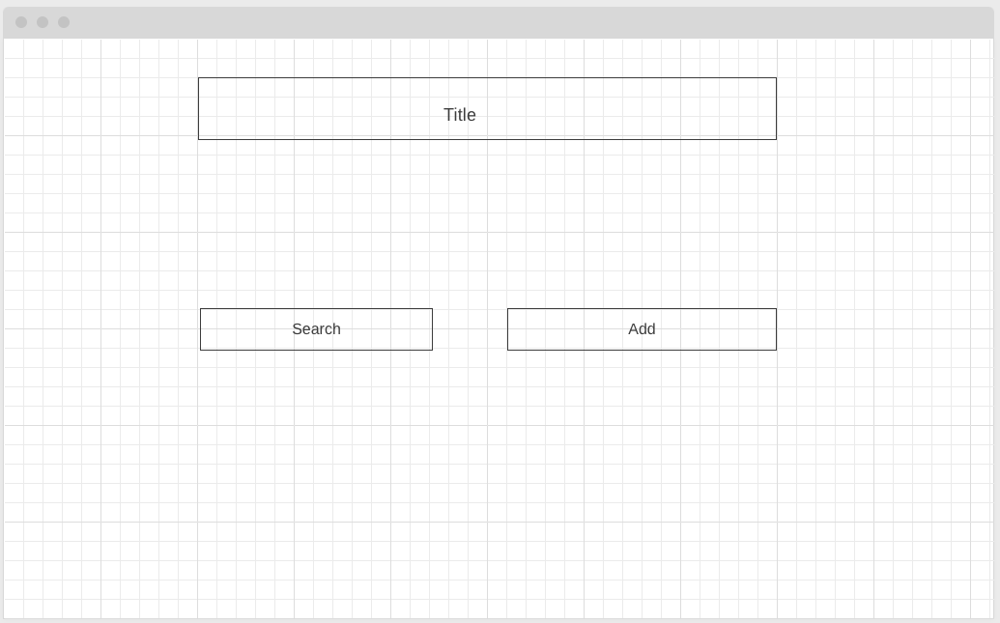
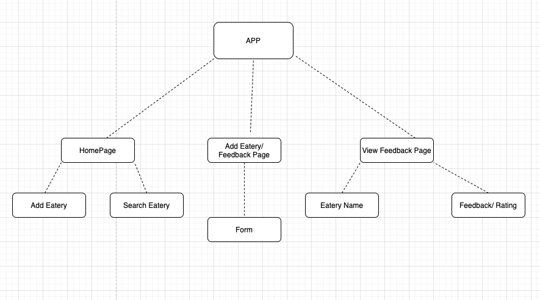

# Project Overview


# VeganEats

## Project Description

Vegan Eats is an Airtable and React builder where the user is able to search through vegan friendly restaurants in Oakland, CA. Users are able to view different categories of food and read reviews on  the restaurants. 

## Wireframes


##### Homepage Wireframe


##### Show Page Wireframe


## Component Hierarchy




## API and Data Sample

Below is  a sample of Airtable returning the data for this base:

```json
{
    "records": [
        {
            "id": "recxkf0ZrlhkezjvZ",
            "fields": {
                "Eatery": "Souley Vegan",
                 "Style": "Soul Food"
                },
            "createdTime": "2021-01-19T16:29:20.000Z"
        },
        {
            "id": "rec7EdztXkBLmkRI2",
            "fields": {
                "Eatery": "Two Mamas' Vegan Kitchen",
                "Style": "Comfort Food"
            },
            "createdTime": "2021-01-19T16:29:20.000Z"
        },
        {
            "id": "rectVCez6XU2JLcJ5",
            "fields": {
                "Eatery": "The Veg Hub",
                "Style": "California Style"
            },
            "createdTime": "2021-01-19T16:29:20.000Z"
        }
    ],
    "offset": "rectVCez6XU2JLcJ5"
}

```

### MVP/PostMVP


#### MVP 

- Utilize Airtable to supply data
- Render data on page 
- Add and delete posts from Airtable

#### PostMVP  

- Allow users to add to posts on Airtable

## Project Schedule


|  Day | Deliverable | Status
|---|---| ---|
|January 20| Prompt / Wireframes / Priority Matrix / Timeframes | Complete
|January 21| Project Approval | Incomplete
|January 23| Core Application Structure (HTML, CSS, etc.) | Incomplete
|January 24| Pseudocode / actual code | Incomplete
|January 25| Initial Clickable Model  | Incomplete
|January 26| MVP | Incomplete
|January 27| Presentations | Incomplete


## Timeframes

| Component | Priority | Estimated Time | Time Invested | Actual Time |
| --- | :---: |  :---: | :---: | :---: |
| Adding Form | H | 3hrs| 3.5hrs | |
| Working with API | H | 3hrs| 2.5hrs |  |
| Project Proposal | H | 1hr| 2.5hrs | 2.5hrs |
| Adding Data | H | 3hrs| 2.5hrs | 2.5hrs |
| Creating Proposal | H | 3hrs| 2.5hrs | 2.5hrs |
| Pseudocoding pg1| H | 3hrs| 2.5hrs | 2.5hrs |
| Pseudocoding pg2| H | 3hrs| 2.5hrs | 2.5hrs |
| Pseudocoding pg3| H | 3hrs| 2.5hrs | 2.5hrs |
| Component CSS pg1 | H | 3hrs| 2.5hrs | 2.5hrs |
| Component CSS pg2 | H | 3hrs| 2.5hrs | 2.5hrs |
| Component CSS pg3 | H | 3hrs| 2.5hrs | 2.5hrs |
| Debugging | H | 5hrs| 2.5hrs | 2.5hrs |
| Total | H | 43hrs| ?hrs | 5hrs |

## SWOT Analysis

### Strengths:

### Weaknesses:

### Opportunities:

### Threats:
